<table>
<tr>
<td valign="top"></td>
<td valign="top"></td>
</tr>
</table>

## Vihaan Kola

**AI Builder · Cybersecurity Student · Instructor @ KKRGENAI**

*Computer Science student building at the intersection of AI and cybersecurity —*
*and teaching the next generation of coders at KKRGENAI.*

 

---

## 👋 About Me

Computer Science student and builder focused on **applied AI** and **cybersecurity** —
I like understanding how systems work, and how to secure them. Alongside my own
projects, I teach **coding and AI to young learners (ages 10–16)** as an instructor at
**KKRGENAI**.

-  Build with **PyTorch**, **Hugging Face**, **LangChain**, and local LLMs via **Ollama**
-  Learning **cybersecurity** — OSINT, penetration testing, and malware analysis (defensive)
-  Teach **Python, AI/ML, and coding fundamentals** to kids and teens at KKRGENAI
-  Currently training a custom vision model for a client garment-analysis project
-  Open to collaborating on **AI** and **security** projects

## 📌 Featured Projects

- ** Garment Analyzer** *(client project — private)* — local vision-LLM app (Qwen + Ollama) that inspects garment photos for stains/damage and suggests care steps. Fully offline. *Currently training a custom detection model to improve accuracy.*
- ** OSINT Reconnaissance Lab** — reconnaissance and digital-footprint analysis using recon-ng in Docker, as part of hands-on security learning.
